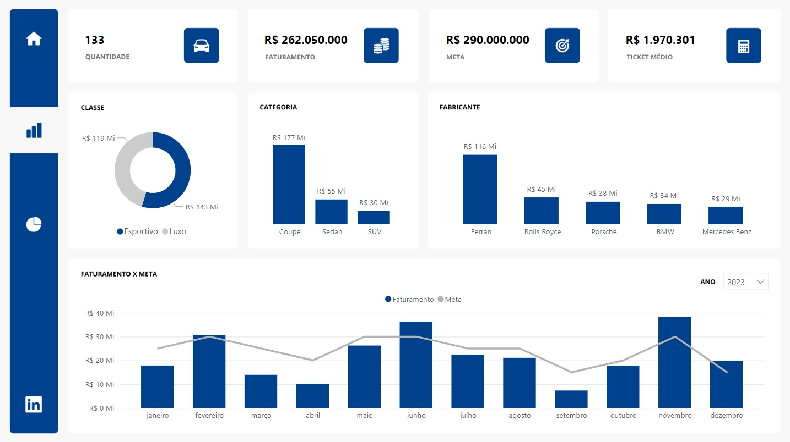
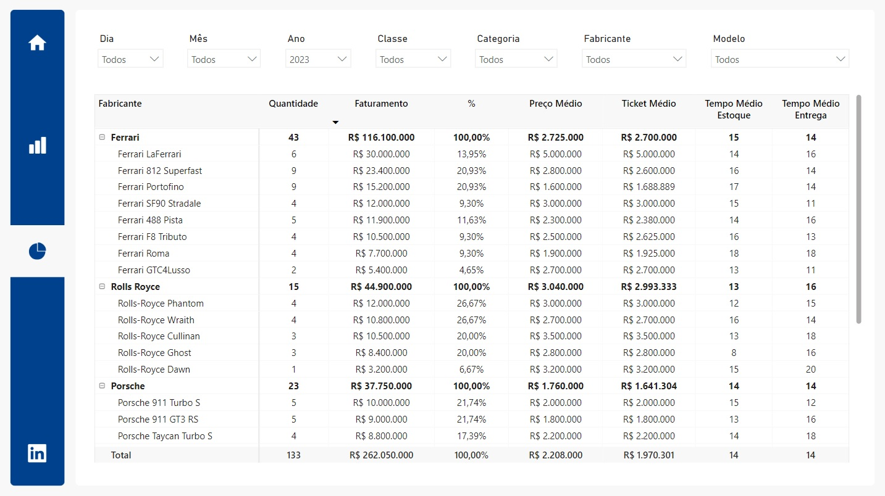

# Relatório de Vendas

## Objetivo
Este relatório tem como objetivo permitir a análise de vendas de uma loja de automóveis.

## Páginas

### Capa
Esta página possui um botão para direcionar o usuário para a tela de Resumo.
  

 

### Resumo
Essa página apresenta alguns indicadores chaves, conforme abaixo.

- Quantidade de Vendas
- Faturamento (R$)
- Meta (R$)
- Ticket Médio (R$)
- Quantidade de Vendas por Classe
- Quantidade de Vendas por Categoria
- Quantidade de Vendas por Fabricante
- Faturamento x Meta x Data de Venda
  

 

### Detalhado

Esta página apresenta informações detalhadas sobre vendas, conforme abaixo.

Matriz:

 - Fabricante
 - Quantidade
 - Faturamento
 - Faturamento (%)
 - Preço (Médio)
 - Ticket Médio
 - Tempo Médio de Estoque
 - Tempo Médio de Entrega

Filtros:

 - Data
 - Classe
 - Categoria
 - Fabricante
 - Modelo
  

 
